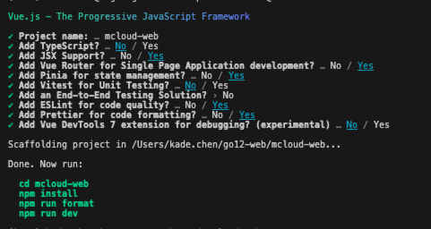

### init project

# npm create vue@latest



1. cd mcloud-web
2. npm install
3. npm run format
4. npm run dev

### 项目结构

```go

├── README.md
├── package.json
├── index.html
├── src
│   ├── api  # 请求接口
│   ├── assets  # 静态资源
│          └── style 全局样式
│   ├── components  # 通用业务组件
│   ├── config  # 全局配置(包含echarts主题)
│          └── settings.json  # 配置文件
│   ├── directives # 指令集（如需，可自行补充）
│   ├── filters # 过滤器（如需，可自行补充）
│   ├── hooks # 全局hooks
│   ├── layout  # 布局
│   ├── locale  # 国际化语言包
│   ├── mock  # 模拟数据
│   ├── views  # 页面模板
│   ├── router # 路由配置
│   ├── store  # 状态管理中心
│   ├── types  # Typescript 类型
│   └── utils  # 工具库
│   └── App.vue  # 视图入口
│   └── main.ts  # 入口文件
└── tsconfig.json

```

v1.0.8 completed template successfully

# Vue副作用警告solution

```vue
Unexpected side effect in "currentLangageClass" computed property Vue 的副作用警告

    currentLangageClass() {
      //禁用 ESLint 规则（在整个文件中禁用）
      /* eslint-disable vue/no-side-effects-in-computed-properties */ 加这行就可以ignore
      return app.value.isLanguage ? (this.$i18n.locale = 'zh-CN') : (this.$i18n.locale = 'en-US')
    }

/_ eslint-disable vue/no-side-effects-in-computed-properties _/禁用 ESLint 规则
```


# basics template successful

```go
v1.0.9
```